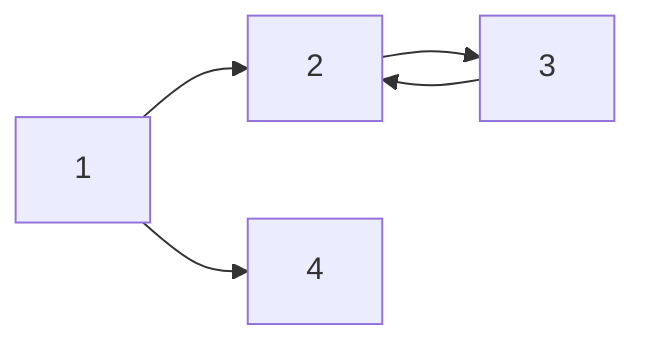

\#은 Header를 의미합니다.

# H1 태그


## H2 태그 - 소제목 작성에 좋다.


### H3 Tag


#### H4 Tag


##### H5 Tag

\# 5개 이상 쓰는 것은 일반 글씨 크기와 같다!

___

**VS Code Extension에서 markdown preview enhanced 검색해서 설치한다.**

*기울임체 별표는 글씨가 기울어집니다*

_italic 언더바는 이텔릭체_

**bold 별표 2개는 두꺼운 글씨체** 

**_기울인 굵은체_**

~~cancel 물결표 2개는 글씨에 라인~~

> 마크다운은 쉬워요 - 인용을 할때 **bold 처리도 가능** 

___

- list 1
* list 2
- list 3
* list 4
    - A
        * B


---


| 제목 | Description |비고 |
|-|-|-|
| 안녕 | 1  | 2|
| 헬로 | 3|4|


___

[링크이름](swcup2002@naver.com)

<a href="swcup2002@naver.com">링크이름</a>


___

`simple code 백슬레시 사용`
``` cpp
# include <stdio.h>

int main(){
    print("hello world);
    return 0;
}
```

``` py
class Unit: # 일반 유닛
    def __init__(self, name, hp, damage):
        self.name = name
        self.hp = hp
        self.damage = damage
        print("{0} 유닛이 생성 되었습니다.".format(self.name))
        print("체력 {0}, 공격력 {1}".format(self.hp, self.damage))

marine1=Unit("마린", 40, 5)
marine2=Unit("마린", 40, 5)
tank = Unit("탱크", 150, 35)
```

``` sh
조금 더 이쁜 결과
```

___

$a+b=c$ 

$a^2_1 + b^2 = c^2$

다음 중 $N$개를 고르시오.

$$(\alpha + \beta)^2 = \alpha^2 + 2 \alpha \beta + \beta^2$$

$$min_Gmax_D$$

$$\alpha \beta \frac{1}{2} 분수$$

___



___


